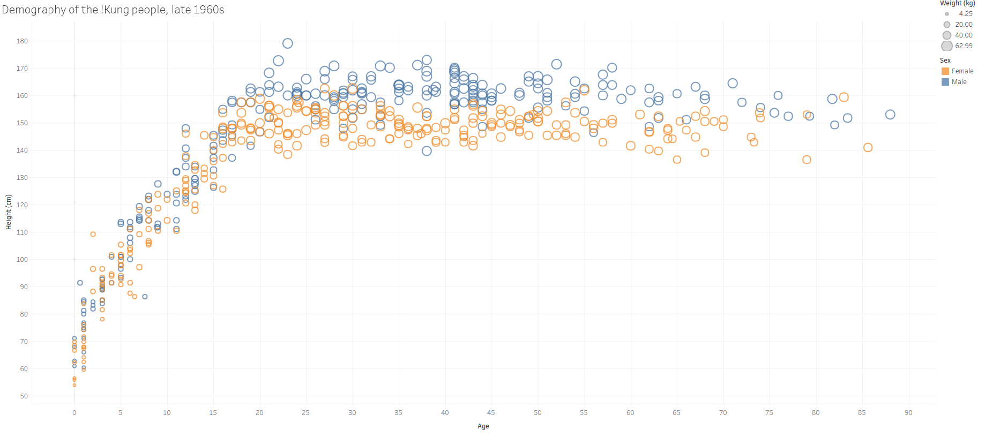
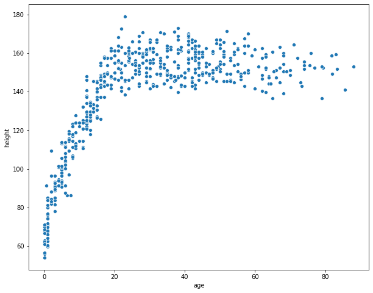
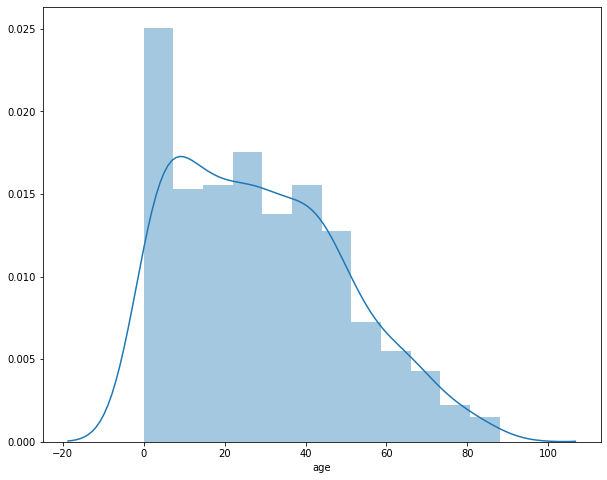
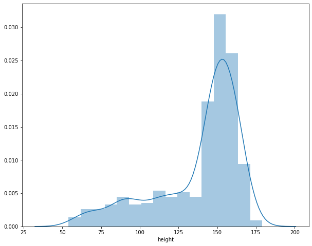

# Growth pattern from birth to adulthood in Kung! tribe

This is the proposal for the capstone project for the Machine Learning Nanodegree in Udacity.

## Domain background 

Height is determined by a combination of genetics and environmental factors. Nutrion and illness in childhood limits the human growth. So height is a very good measurement of living conditions and therefore used by the historians to understand the evolution of human living condition. Additionally, the variation in height within a given population is largely determined by the genetics. 

In this work, we will look at height-vs-age data collected by Nancy Powell in 1969 for the Kung! tribe. The goal is to capture the characteristic and variation in  this age-vs-height data in a model. By comparing the historical evolution of this model, which is not a part of this study, we can track the progress of human living standard.

Kung! is a tribe which lives in the southern part of Africa, on the western part of the Kalahari sand system. They are hunter-gatherers with a total population somewhere between 50,000 and 100,000.  The !Kung language, commonly called $Ju$, is one of the larger click languages. Here is a [wikipedia link](https://en.wikipedia.org/wiki/%C7%83Kung_people) for more information about Kung! tribe.

## Project Aim

The project aims at understanding the relationship between the height and age for the Kung! tribe.
Below is a snapshot of the data from a [public website](https://public.tableau.com/views/kung-san/Attributes?%3Aembed=y&%3AshowVizHome=no&%3Adisplay_count=y&%3Adisplay_static_image=y&%3AbootstrapWhenNotified=true).

Fig 1: Plot of height vs age data for Kalahari Kung! San people collected by Nancy Howell.

## Problem statement 

This is a regression and supervised learning problem where the model takes age as input and produces the expected output for height.
We will built a probabilistic machine learning model for the height vs age relationship for the Kung! tribe. 

This problem is picked from the book [Statistical Rethinking](https://xcelab.net/rm/statistical-rethinking/) by Richard McElreath.

## Dataset

The dataset was collected by Nancy Howell. It can be found at this [location](https://rdrr.io/github/rmcelreath/rethinking/man/Howell1.html). 

It consists of following columns:

* height: Height in cm
* weight: Weight in kg
* age: Age in years
* male: Gender indicator
* age.at.death: If deceased, age at death
* alive: Indicator if still alive

For our purpose, we will only use the height and age columns.

### **Descriptive analysis**

**Scatter plot for age vs height**

**Distribution of age**

**Distribution of height**

## Solution statement 

Given the non-linear relationship between the height and age data in Fig 1, we will fit a set of polynomial models to the data.

## Benchmark model 

We will use a simple linear model as a benchmark for this.

## Evaluation metrics 

We will compare different polynomial models using [Widely Applicable Information Criterion](https://en.wikipedia.org/wiki/Watanabe%E2%80%93Akaike_information_criterion) (WAIC) and test-sample deviance.

## Project design

The project will follow the following workflow:

* Download the data.
* Select only the age and height columns
* Standardize the data
* Split the data into train and test data sets.
* Define polynomial models up to degree p and weakly regularizing priors for the parameters
* Fit the p models on the training data set 
* Compare the models using WAIC
  * Choose the model with the best WAIC ($M_{WAIC}$)
* Compare the models using test-sample deviance
  * Choose the model with the best test-sample deviance $(M_{best})$
* Does WAIC do a good job of estimating the test deviance?
  * $M_{WAIC}$ = $M_{best}$
* Choose the best model ($M_{best}$)

We will use the [PyMC3](https://docs.pymc.io/) package for this work. PyMC3 is a Python package for Bayesian statistical modeling and Probabilistic Machine Learning.

## References

1. Life Histories of the Dobe !Kung: Food, Fatness, and Well-being over the Life-span. Nancy Howell 2010
