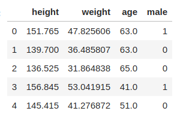
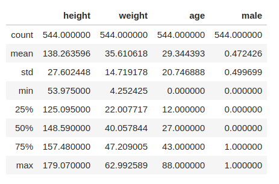
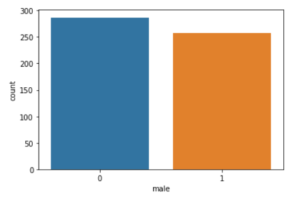
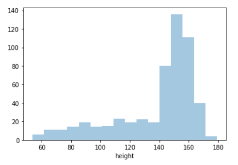
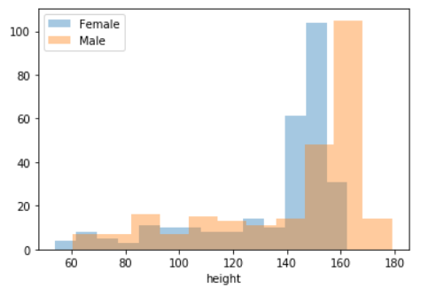
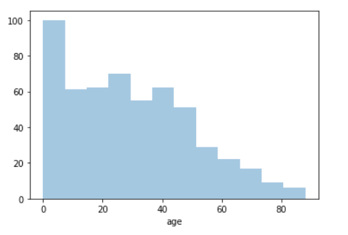
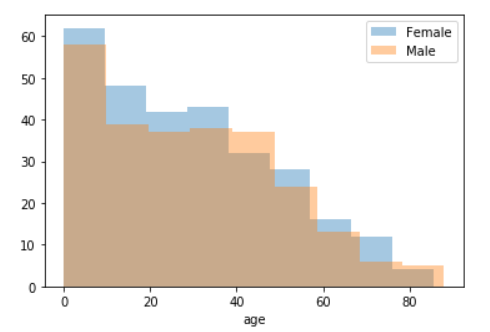
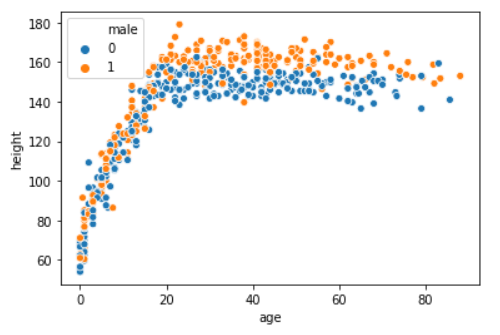

## Data Exploration

This is a demographic data from Kalahari !Kung San people collected by Nancy Howell. The data has 544 entries that contains height, weight, age and gender information. Below is a snapshot of the data:

The next figure shows the summary statistics of the data.

The data contains 257 male and 287 females as shown below.

## Exploratory visualization

In this section, we will do exploratory visualizations to better understand the underlying data. For this work, we are primarily interested in understanding the height vs age relationship in the data. So the focus of this section will be on those columns of the data.

First, we'll look at the distribution of the height data, as shown in the figure below. The height values range from 50 cms to 180 cms and majority of the data lies between 140 cms to 170 cms.

If we split the distribution based on gender, as shown in figure below, we see that the males on average are taller than females.

Next, we'll look at the distribution of age in the figure below. The data covers a wide range of age starting from newborns to around 90 years old.

On comparing the male vs female age distribution, we see that both the genders are well represented for all ages.

Finally, we can look at the scatter plot of age vs height. This plot is of particular interest as this is the relationship we would like to capture in a probabilistic model.

As expected, the height seems to eventually plateau with age. For this dataset, that plateau seems to be occurring around age of 20. Moreover, male heights seem to be taller than females, in general. As this data was collected in a time span of 2 years, the decrease in height with ag towards the end is a very interesting feature. At a high-level, this indicates that younger generation is taller than the older generation which hints towards an improving lifestyle and better nutrition. Overall, the relationship is very non-linear in nature and can't be captured by a simple linear relationship between height and age.

## Algorithms and Techniques: Probabilistic Machine Learning

In the probabilistic modeling setting, we have a model which describes the data that one observes from a system. We use probability theory to express all forms of uncertainty and noise associated with our model. Then we use Bayes rules to infer unknown quantities, adapt our models, make predictions and learn from data. We have a very similar setting here where we are trying to invert for parameters in the polynomial models. We start with some prior distributions on these parameters which express our initial belief along with the uncertainty. Then we use data to infer these unknown parameters and make predictions based on the learned model. We are particularly interested in the uncertainty or the distribution as that represents some of the genetic variations present in the data. [5, 6, 7]

## Benchmark

As we will in the next sections, we will be fitting a collection of polynomial models to this data and utilize information criteria to choose the best model among them. For the benchmarking purposes we will assume a linear model to be our benchmark.

5] Andrew Gelman, Hal S Stern, John B Carlin, David B Dunson, Aki Vehtari, and Donald B Rubin. Bayesian data analysis. Chapman and Hall/CRC, 2013.

[6] John Kruschke. Doing Bayesian data analysis: A tutorial with R, JAGS, and Stan. Academic Press, 2014.

[7] Michael Betancourt. A conceptual introduction to hamiltonian monte carlo. arXiv preprint arXiv:1701.02434, 2017.
