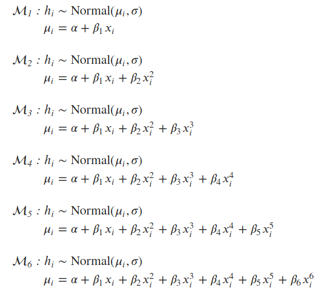
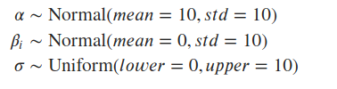

## Data Preprocessing

The data does not have any missing or unphysical values. For modeling purposes, the age column (feature vector) was standardize. Standardization typically means rescaling data to have a mean of 0 and a standard deviation of 1 (unit variance). THe formula for standardization is:

$X' = \frac{X - \mu}{\sigma}$

## Implementation

### Probabilistic Models:

The following polynomial models were fitted to the data using the probabilistic programming package PyMC3.

Where $h_i$ and $x_i$ are heights and ages respectively. The means of the models are given by $\mu_i$ and we assume a normal distribution around the mean with standard deviation $\sigma$. We also define weakly regularizing priors for the parameters as given below:

### Evaluation metrics

A good model is the one that strikes the right balance between parsimony and fitting the data. Information criterion, which provides a way to measure this balance, can be used to compare models that are fitted to the same data. The model with the lowest information criterion is the best model.

For this work we will use one of the information criterion known as Watanabe–Akaike information criterion (WAIC). We will rank the models based on their WAIC scores and the model with lowest WAIC score is our best model.

**[Widely Applicable Information Criterion (WAIC)](http://www.stat.columbia.edu/~gelman/research/published/waic_understand3.pdf):** The distinguishing feature of WAIC is that it is pointwise. It access flexibility of a model with respect to fitting each observation, and then sumps up across all observations. WAIC is given by the following formula:

$WAIC = -2 (\sum_{i=1}^N \log Pr(y_i) - \sum_{i=1}^N V(y_i))$

Where $V(y_i)$ is the variance in the log-likelihood for observation $i$ in the training sample and $\log Pr(y_i) = -0.5*log{2 \pi \sigma^2} - \frac{ (y_i - \mu_i)^2 } {2 \sigma^2}$.

One of the most common ways to perform model comparisons is cross-validation. However, due it's limitations on sparse data and repeated fitting, researchers have always been interested in estimating alternate ways to perform bias-corrections. Information criterions like AIC, BIC and WAIC are born out of that necessity and can be generally thought of as approximations to different versions of cross-validation. In this work, we will also compare how good of a job does WAIC do in estimating out-of sample deviance, or in other words we'll see how close WAIC comes to cross-validation method.
