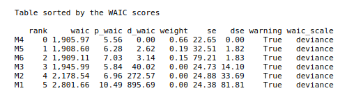
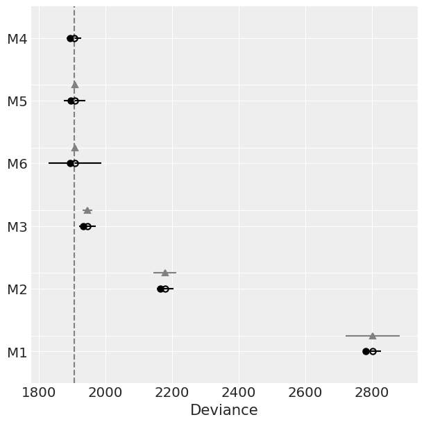
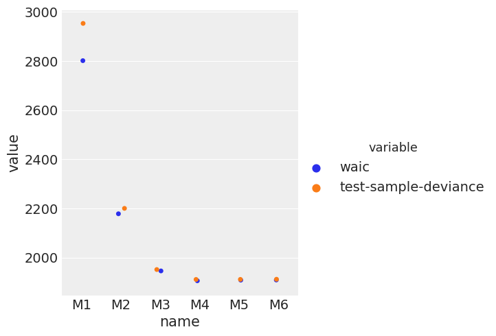
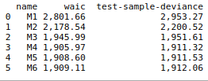
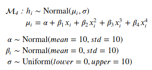
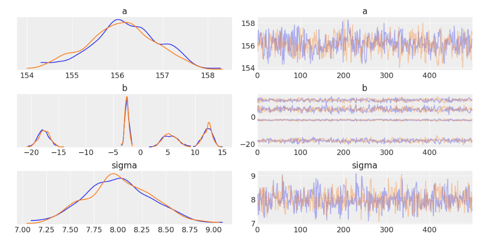

## Results

### Model Comparison

The plot below shows the high density posterior (HPD) plots for the six polynomial models. The linear model, as expected, doesn't capture the data very well. Even the quadratic model has a strong bias. Starting from the cubic model, the higher order polynomial model seem to capture the complexity in the data.

One of the most important characteristics of probability models is that it also provides the uncertainty bounds of the models. Here we have plotted 95% confidence bounds. One can see that the confidence bounds are tight where the data is dense and the bounds widen near the sparsely populated region, for high age values.

The final model’s qualities—such as parameters—are evaluated in detail. Some type of analysis is used to validate the robustness of the model’s solution.

### Information criterion

In this section, we present quantitative measures to compare the various models. As explained in the sections above, we use an information criterion known as WAIC to compare the models. The figure below shows a sorted table of models with ascending WAIC scores.

According to this table, model $\mathcal{M}_4$, polynomial with degree 4 is the best model as it makes the best out-of-sample predictions. The table above is also shown in a plot below along with the uncertainty around the WAIC score.

The linear model, which was considered our base or benchmark model, has the worst out-of-sample prediction compared to any model. The linear model has a strong bias and cannot capture the structure of the data.

### Out-of-sample prediction versus test deviance

As discussed in the previous sections, WAIC is an approximation of cross-validation. In this part, we will validate how good of a job WAIC score does in estimating the test deviance. We had split the dataset in two equal halves and fit the models on the first half of the data. The plot below WAIC score and test deviance plotted on the same curve for each model.

The WAIC score do a good job in predicting the test deviance. Apparently, based on test deviance also the model $\mathcal{M}_4$ is the best model.

## Best model: $\mathcal{M}_4$

Finally, we show some details about the model $\mathcal{M}_4$. The polynomial model with degree 4 is given by the following probability model:

The plot below shows the posterior distributions and trace plots of all the parameters in this model: $\alpha, \beta_1, \beta_2, \beta_3, \beta_4$ and $\sigma$.

All the parameters have a nice compact posterior distributions. The figure in the middle shows the posterior distributions of all the four linear coefficients.

## Conclusion:

In this work, we built a probabilistic model for the age vs heights demographic data from Kalahari !Kung San people.
We tested a number of probability models on the data and performed a model evaluation process to determine the best model. The best model was the one which struck the right balance between model complexity and fitting the data. Given the probabilistic approach, the fitted models also provided uncertainty estimates on the fitted parameters and the model predictions. The uncertainty on the predictions for a fixed age can be used an estimate for the genetic variability in the population.
