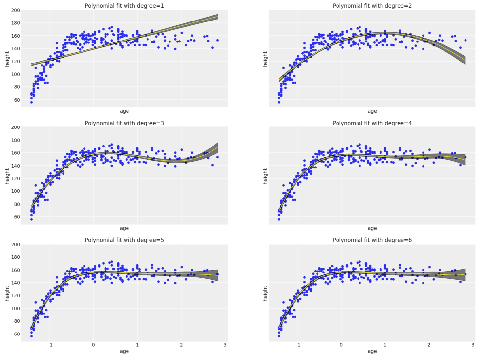

## Results

### Model Comparison

The plot below shows the high density posterior (HPD) plots for the six polynomial models. The linear model, as expected, doesn't capture the data very well. Even the quadratic model has a strong bias. Starting from the cubic model, the higher order polynomial model seem to capture the complexity in the data.

One of the most important characteristics of probability models is that it also provides the uncertainty bounds of the models. Here we have plotted 95% confidence bounds. One can see that the confidence bounds are tight where the data is dense and the bounds widen near the sparsely populated region, for high age values.

The final model’s qualities—such as parameters—are evaluated in detail. Some type of analysis is used to validate the robustness of the model’s solution.

### Information criterion

In this section, we present quantitivie measures to compare the various models. 

Justification

The final results are compared to the benchmark result or threshold with some type of statistical analysis. Justification is made as to whether the final model and solution is significant enough to have adequately solved the problem.
