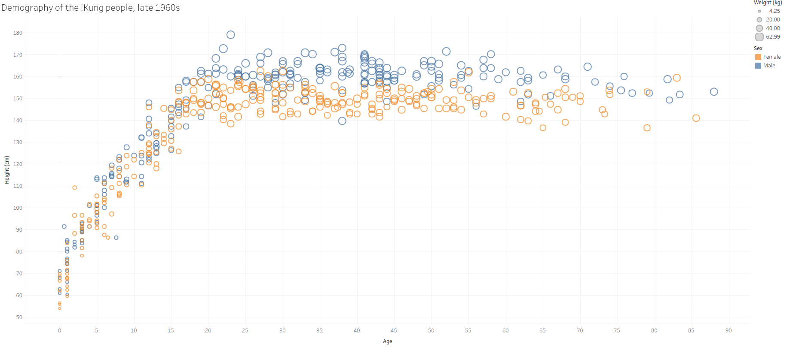
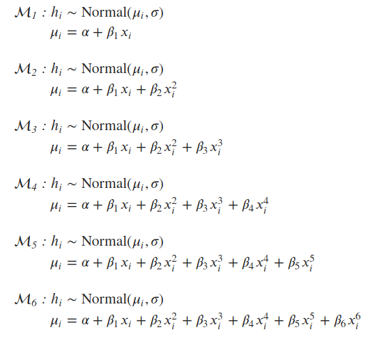
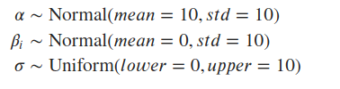
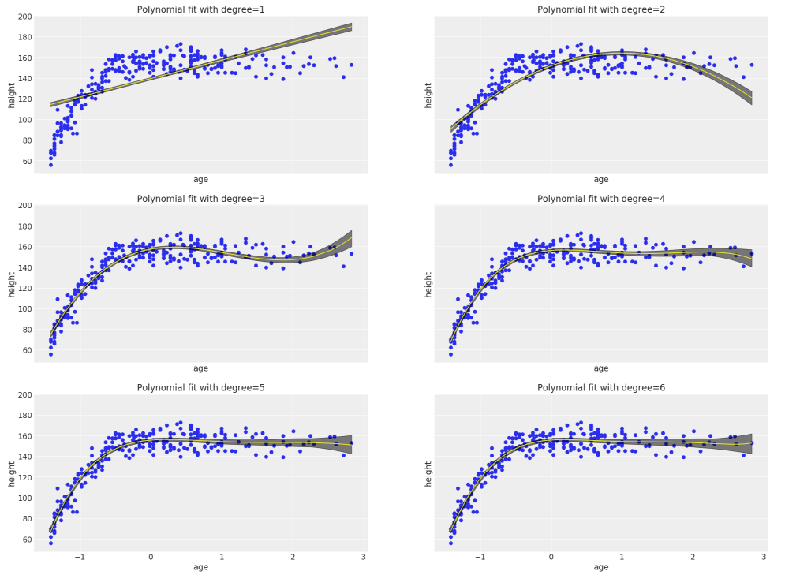
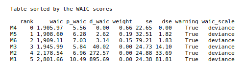
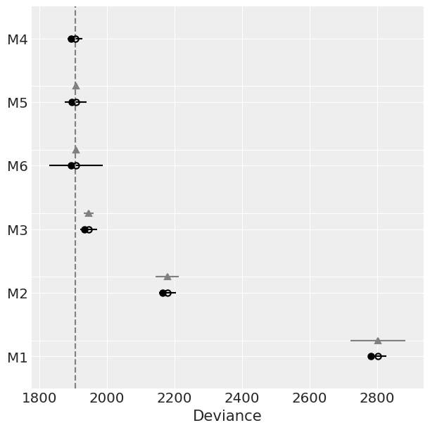
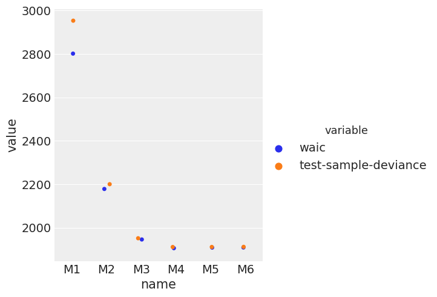
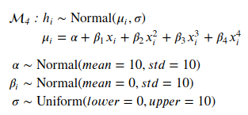
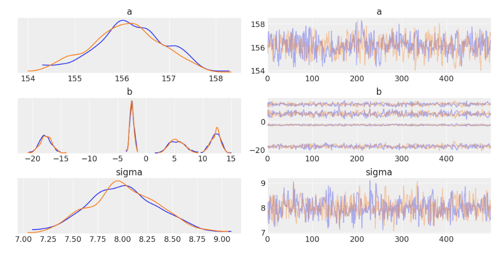

# Capstone Project

## Domain background

Height is determined by a combination of genetics and environmental factors. Nutrition and illness in childhood limits the human growth. So height is a very good measurement of living conditions and therefore used by the historians to understand the evolution of human living condition [1]. Additionally, the variation in height within a given population is largely determined by the genetics.

In this work, we will look at height-vs-age data collected by Nancy Powell in 1969 for the Kung! tribe.[2] The goal is to capture the characteristic and variation in this age-vs-height data into a model. By comparing the historical evolution of this model, which is not a part of this study, we can estimate the progress of human living standard.

Kung! is a tribe which lives in the southern part of Africa, on the western part of the Kalahari sand system. They are hunter-gatherers with a total population somewhere between 50,000 and 100,000. The !Kung language, commonly called $Ju$, is one of the larger click languages. Here is a [wikipedia link](https://en.wikipedia.org/wiki/%C7%83Kung_people) for more information about Kung! tribe.

## Project Aim

The project aims at understanding the relationship between the height and age for the Kung! tribe.
Below is a snapshot of the data from a [public website](https://public.tableau.com/views/kung-san/Attributes?%3Aembed=y&%3AshowVizHome=no&%3Adisplay_count=y&%3Adisplay_static_image=y&%3AbootstrapWhenNotified=true).

Fig 1: Plot of height vs age data for Kalahari Kung! San people collected by Nancy Howell.

## Problem statement

This is a regression and supervised learning problem where the model takes age as input and produces the expected output for height.
We will built a probabilistic machine learning model for the height vs age relationship for the Kung! tribe.

This problem is picked from the book [Statistical Rethinking](https://xcelab.net/rm/statistical-rethinking/) by Richard McElreath.

## Data Exploration

The dataset was collected by Nancy Howell. It can be found at this [location](https://rdrr.io/github/rmcelreath/rethinking/man/Howell1.html).

It consists of following columns:

- height: Height in cm
- weight: Weight in kg
- age: Age in years
- male: Gender indicator
- age.at.death: If deceased, age at death
- alive: Indicator if still alive

For our purpose, we will only use the height and age columns.

This is a demographic data from Kalahari !Kung San people collected by Nancy Howell. The data has 544 entries that contains height, weight, age and gender information. Below is a snapshot of the data:

The next figure shows the summary statistics of the data.

The data contains 257 male and 287 females as shown below.

## Exploratory visualization

In this section, we will do exploratory visualizations to better understand the underlying data. For this work, we are primarily interested in understanding the height vs age relationship in the data. So the focus of this section will be on those columns of the data.

First, we'll look at the distribution of the height data, as shown in the figure below. The height values range from 50 cms to 180 cms and majority of the data lies between 140 cms to 170 cms.

If we split the distribution based on gender, as shown in figure below, we see that the males on average are taller than females.

Next, we'll look at the distribution of age in the figure below. The data covers a wide range of age starting from newborns to around 90 years old.

On comparing the male vs female age distribution, we see that both the genders are well represented for all ages.

Finally, we can look at the scatter plot of age vs height. This plot is of particular interest as this is the relationship we would like to capture in a probabilistic model.

As expected, the height seems to eventually plateau with age. For this dataset, that plateau seems to be occurring around age of 20. Moreover, male heights seem to be taller than females, in general. As this data was collected in a time span of 2 years, the decrease in height with ag towards the end is a very interesting feature. At a high-level, this indicates that younger generation is taller than the older generation which hints towards an improving lifestyle and better nutrition. Overall, the relationship is very non-linear in nature and can't be captured by a simple linear relationship between height and age.

## Algorithms and Techniques: Probabilistic Machine Learning

In the probabilistic modeling setting, we have a model which describes the data that one observes from a system. We use probability theory to express all forms of uncertainty and noise associated with our model. Then we use Bayes rules to infer unknown quantities, adapt our models, make predictions and learn from data. We have a very similar setting here where we are trying to invert for parameters in the polynomial models. We start with some prior distributions on these parameters which express our initial belief along with the uncertainty. Then we use data to infer these unknown parameters and make predictions based on the learned model. We are particularly interested in the uncertainty or the distribution as that represents some of the genetic variations present in the data. [3, 4, 5]

## Benchmark

As we will in the next sections, we will be fitting a collection of polynomial models to this data and utilize information criteria to choose the best model among them. For the benchmarking purposes we will assume a linear model to be our benchmark.

## Data Preprocessing

The data does not have any missing or unphysical values. For modeling purposes, the age column (feature vector) was standardize. Standardization typically means rescaling data to have a mean of 0 and a standard deviation of 1 (unit variance). THe formula for standardization is:

$X' = \frac{X - \mu}{\sigma}$

## Implementation

### Probabilistic Models:

The following polynomial models were fitted to the data using the probabilistic programming package PyMC3.

Where $h_i$ and $x_i$ are heights and ages respectively. The means of the models are given by $\mu_i$ and we assume a normal distribution around the mean with standard deviation $\sigma$. We also define weakly regularizing priors for the parameters as given below:

### Evaluation metrics

A good model is the one that strikes the right balance between parsimony and fitting the data. Information criterion, which provides a way to measure this balance, can be used to compare models that are fitted to the same data. The model with the lowest information criterion is the best model.

For this work we will use one of the information criterion known as Watanabe–Akaike information criterion (WAIC). We will rank the models based on their WAIC scores and the model with lowest WAIC score is our best model.

**[Widely Applicable Information Criterion (WAIC)](http://www.stat.columbia.edu/~gelman/research/published/waic_understand3.pdf):** The distinguishing feature of WAIC is that it is pointwise. It access flexibility of a model with respect to fitting each observation, and then sumps up across all observations. WAIC is given by the following formula:

$WAIC = -2 (\sum_{i=1}^N \log Pr(y_i) - \sum_{i=1}^N V(y_i))$

Where $V(y_i)$ is the variance in the log-likelihood for observation $i$ in the training sample and $\log Pr(y_i) = -0.5*log{2 \pi \sigma^2} - \frac{ (y_i - \mu_i)^2 } {2 \sigma^2}$.

One of the most common ways to perform model comparisons is cross-validation. However, due it's limitations on sparse data and repeated fitting, researchers have always been interested in estimating alternate ways to perform bias-corrections. Information criterions like AIC, BIC and WAIC are born out of that necessity and can be generally thought of as approximations to different versions of cross-validation. In this work, we will also compare how good of a job does WAIC do in estimating out-of sample deviance, or in other words we'll see how close WAIC comes to cross-validation method.

## Results

### Model Comparison

The plot below shows the high density posterior (HPD) plots for the six polynomial models. The linear model, as expected, doesn't capture the data very well. Even the quadratic model has a strong bias. Starting from the cubic model, the higher order polynomial model seem to capture the complexity in the data.

One of the most important characteristics of probability models is that it also provides the uncertainty bounds of the models. Here we have plotted 95% confidence bounds. One can see that the confidence bounds are tight where the data is dense and the bounds widen near the sparsely populated region, for high age values.

The final model’s qualities—such as parameters—are evaluated in detail. Some type of analysis is used to validate the robustness of the model’s solution.

### Information criterion

In this section, we present quantitative measures to compare the various models. As explained in the sections above, we use an information criterion known as WAIC to compare the models. The figure below shows a sorted table of models with ascending WAIC scores.

According to this table, model $\mathcal{M}_4$, polynomial with degree 4 is the best model as it makes the best out-of-sample predictions. The table above is also shown in a plot below along with the uncertainty around the WAIC score.

The linear model, which was considered our base or benchmark model, has the worst out-of-sample prediction compared to any model. The linear model has a strong bias and cannot capture the structure of the data.

### Out-of-sample prediction versus test deviance

As discussed in the previous sections, WAIC is an approximation of cross-validation. In this part, we will validate how good of a job WAIC score does in estimating the test deviance. We had split the dataset in two equal halves and fit the models on the first half of the data. The plot below WAIC score and test deviance plotted on the same curve for each model.

The WAIC score do a good job in predicting the test deviance. Apparently, based on test deviance also the model $\mathcal{M}_4$ is the best model.

## Best model: $\mathcal{M}_4$

Finally, we show some details about the model $\mathcal{M}_4$. The polynomial model with degree 4 is given by the following probability model:

The plot below shows the posterior distributions and trace plots of all the parameters in this model: $\alpha, \beta_1, \beta_2, \beta_3, \beta_4$ and $\sigma$.

All the parameters have a nice compact posterior distributions. The figure in the middle shows the posterior distributions of all the four linear coefficients.

## Conclusion:

In this work, we built a probabilistic model for the age vs heights demographic data from Kalahari !Kung San people.
We tested a number of probability models on the data and performed a model evaluation process to determine the best model. The best model was the one which struck the right balance between model complexity and fitting the data. Given the probabilistic approach, the fitted models also provided uncertainty estimates on the fitted parameters and the model predictions. The uncertainty on the predictions for a fixed age can be used an estimate for the genetic variability in the population.

## References

[1.] Walker, R., Gurven, M., Hill, K., Migliano, A., Chagnon, N., De Souza, R., Djurovic, G., Hames, R., Hurtado, A. M., Kaplan, H., Kramer, K., Oliver, W. J., Valeggia, C., & Yamauchi, T. (2006). Growth rates and life histories in twenty-two small-scale societies. American Journal of Human Biology, 18(3), 295-311. https://doi.org/10.1002/ajhb.20510

[2.] Nancy Howell (2010). Life Histories of the Dobe !Kung: Food, Fatness, and Well-being over the Life-span.

[3] Andrew Gelman, Hal S Stern, John B Carlin, David B Dunson, Aki Vehtari, and Donald B Rubin. Bayesian data analysis. Chapman and Hall/CRC, 2013.

[4] John Kruschke. Doing Bayesian data analysis: A tutorial with R, JAGS, and Stan. Academic Press, 2014.

[5] Michael Betancourt. A conceptual introduction to hamiltonian monte carlo. arXiv preprint arXiv:1701.02434, 2017.
