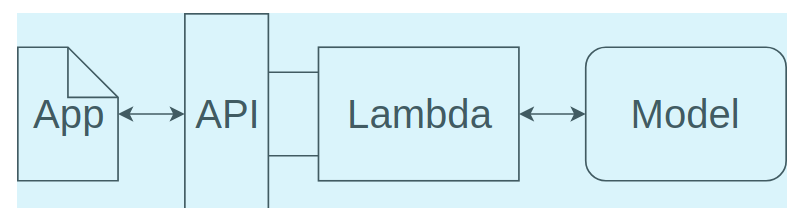

## Deployment of webapp

The structure for our web app will look like the diagram below.

What this means is that when someone uses our web app, the following will occur.

* To begin with, a user will type out a review and enter it into our web app.
* Then, our web app will send that review to an endpoint that we created using API Gateway. This endpoint will be constructed so that anyone (including our web app) can use it.
* API Gateway will forward the data on to the Lambda function
* Once the Lambda function receives the user's review, it will process that review by tokenizing it and then creating a bag of words encoding of the result. After that, it will send the processed review off to our deployed model.
* Once the deployed model performs inference on the processed review, the resulting sentiment will be returned back to the Lambda function.
* Our Lambda function will then return the sentiment result back to our web app using the endpoint that was constructed using API Gateway.

<<<<<<< HEAD

**lambda function**: Function as a service. Run the function when specific event occurs. Do not run it the whole time.
=======
**In SageMake deploying the model means, creating an Endpoint.**
>>>>>>> 3a615eeaf41971e7e7e53ae579e6555eac68a4a9
