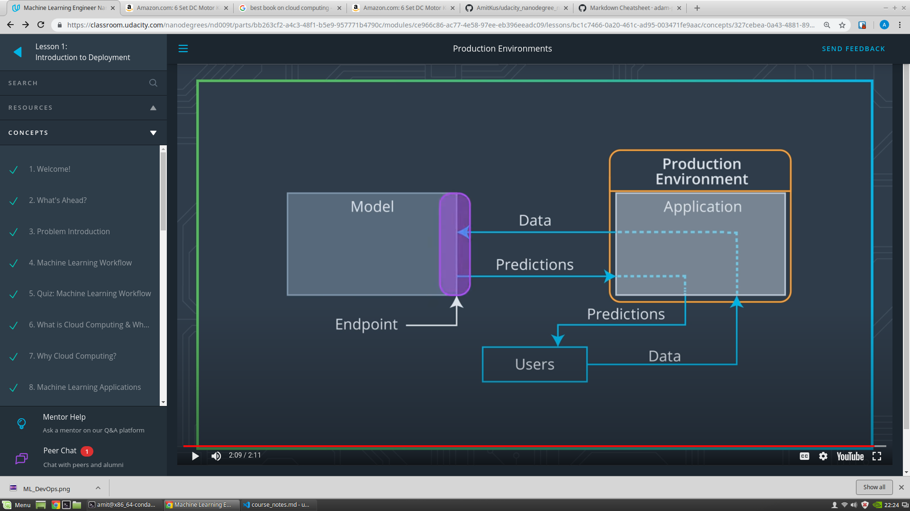

##Paths to Deployment:

* Python model is recoded into the programming language of the production environment.
* Model is coded in Predictive Model Markup Language (PMML) or Portable Format Analytics (PFA).
* Python model is converted into a format that can be used in the production environment.

 ### Option 3:

 Most popular machine learning software frameworks, like PyTorch, TensorFlow, SciKit-Learn, have methods that will convert Python models into intermediate standard format, like **ONNX (Open Neural Network Exchange format)**. This intermediate standard format then can be converted into the software native to the production environment.

 
 

## Production Environment and the Endpoint

When we discussed the production environment, the endpoint was defined as the interface to the model. This interface (endpoint) facilitates an ease of communication between the model and the application. Specifically, this interface (endpoint)

* Allows the application to send user data to the model and
* Receives predictions back from the model based upon that user data.

One way to think of the endpoint that acts as this interface, is to think of a Python program where:

* the endpoint itself is like a function call
* the function itself would be the model and
* the Python program is the application.